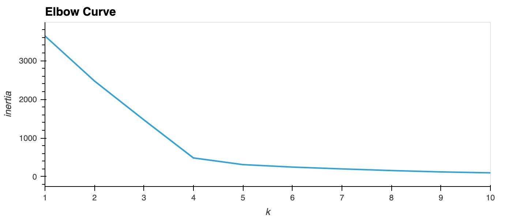
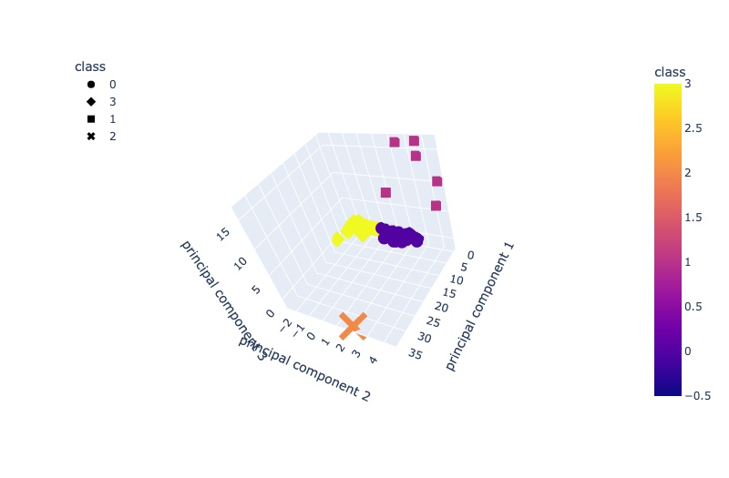
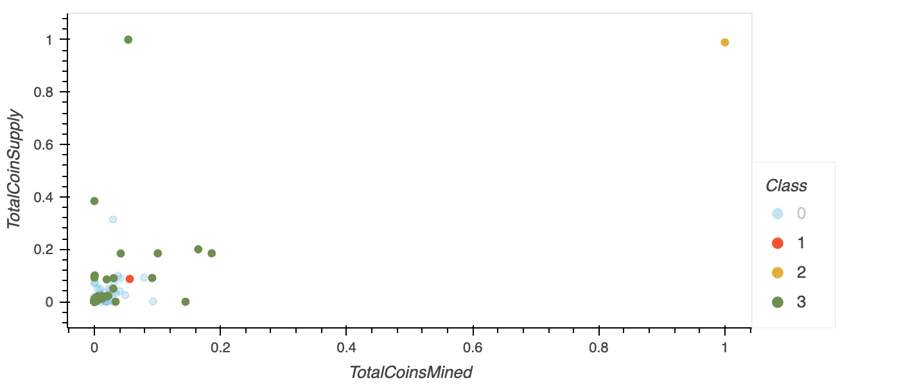

# Module 18: Cryptocurrencies

## Background
Accountability accounting (Martha's client) is interested in offereing a new cryptocurrency investment portfolio for its customers. The company, however, is lost in the vast universe of cyrptocurrencies. 

## Purpose
To creat a report that includes what cryptocurrencies are on the trading market and how they could be grouped to create a classification system for this new investment.

## Description
- Used Panda to preprocess data
- Used the StandardScaler library to standardize features
- Applied PCA
- Created an instance of the K-means algorithm and make predictions
- Created an elbow curve
- Created a scatter plot using hvplot
- Created a 3D scatter plot with Plotly Express

